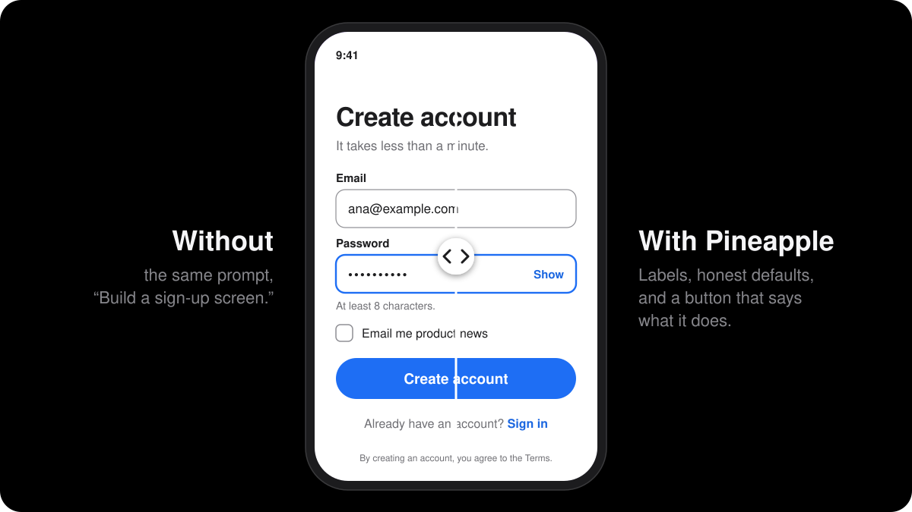

<p align="center">
  
</p>

<p align="center">
  <a href="#install"><strong>Install&nbsp;›</strong></a>&emsp;&emsp;<a href="skills/pineapple/SKILL.md">Read the skill&nbsp;›</a>
</p>

<p align="center">
  
</p>

<p align="center">
  
</p>

<p align="center">
  
</p>

<p align="center">
  
</p>

<p align="center">
  
</p>

<p align="center">
  
  <br><sub>Three real tasks, one run each, on the previous version. A strong signal, not a benchmark. Tests in <a href="evals">evals</a>.</sub>
</p>

<p align="center">
  
</p>

## Install

```bash
npx skills add chromejaw/pineapple
```

<sub>Works with Claude Code, Codex, Cursor, and 70+ other agents. Add <code>-g</code> to install for all your projects.</sub>

<br>

<p align="center">
  <sub>MIT licensed. Apple material quoted in <code>skills/pineapple/references/</code> remains Apple’s (<a href="NOTICE">NOTICE</a>).<br>
  Not affiliated with Apple Inc. Apple is a trademark of Apple Inc., registered in the U.S. and other countries.</sub>
</p>
