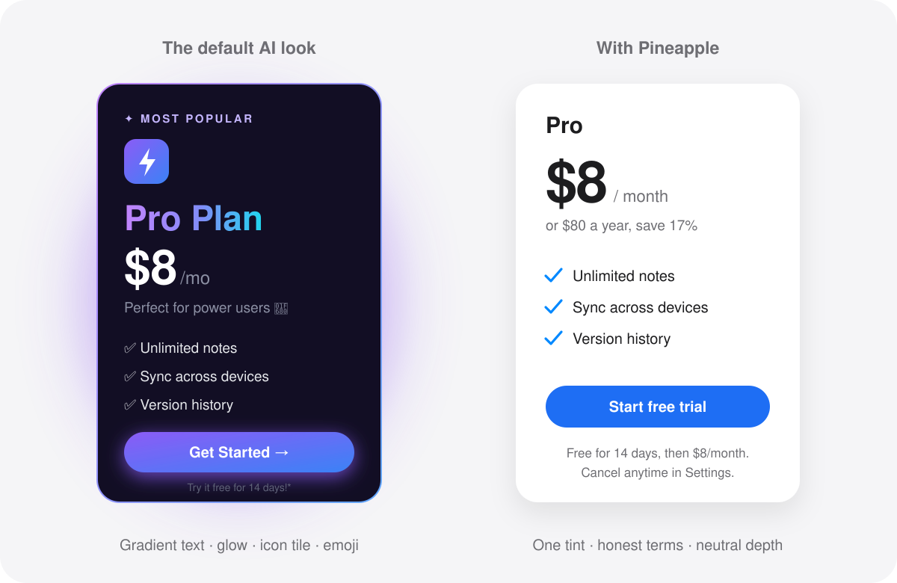
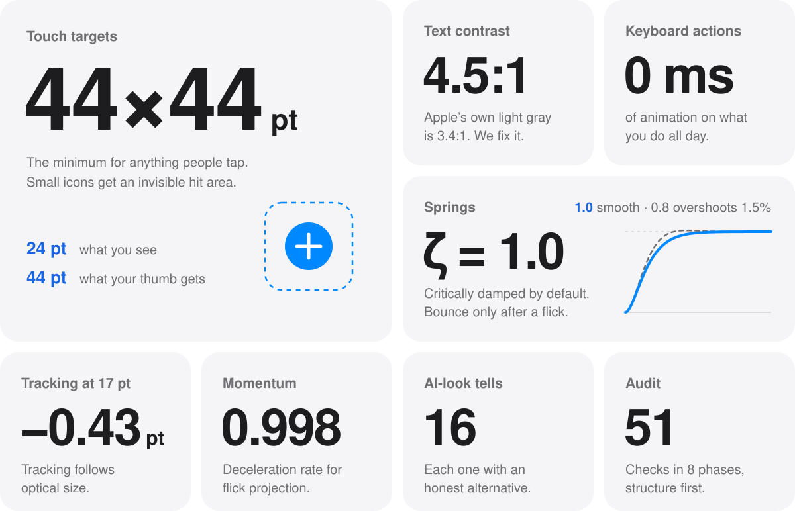
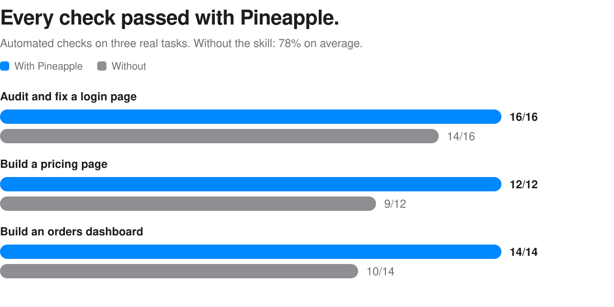
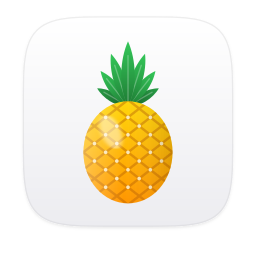

<p align="center">
  <picture>
    <source media="(prefers-color-scheme: dark)" srcset=".github/assets/hero-dark.svg">
    
  </picture>
</p>

<p align="center">
  <strong>A design skill for AI coding agents.</strong><br>
  It teaches your agent how Apple designs: the principles, the numbers, and the restraint.<br>
  Then it applies them to whatever you’re building, on any stack.
</p>

<p align="center">
  <a href="#install"><strong>Install&nbsp;›</strong></a>&emsp;&emsp;<a href="#how-it-works">How it works&nbsp;›</a>&emsp;&emsp;<a href="#the-eight-principles">Principles&nbsp;›</a>&emsp;&emsp;<a href="SKILL.md">Read the skill&nbsp;›</a>
</p>

<p align="center"><sub>Works with Claude Code, Codex, and any agent that reads a <code>SKILL.md</code>.</sub></p>

<br>

<h3 align="center">Ask an agent for “premium,” and you get a purple gradient.</h3>
<p align="center">Pineapple gives it something better to reach for.</p>

<p align="center">
  <picture>
    <source media="(prefers-color-scheme: dark)" srcset=".github/assets/tells-dark.svg">
    
  </picture>
</p>

<p align="center">
  Same plan. Same price. The card on the left is what agents build by default.<br>
  Pineapple names 16 of these reflexes, from gradient text and glowing cards to emoji used as icons,<br>
  and gives your agent the honest alternative for each one. <a href="references/craft-details-and-tells.md#3-default-tells-and-what-to-do-instead">See all 16&nbsp;›</a>
</p>

<br>

<h3 align="center">Every value has a reason.</h3>
<p align="center">No “make it pop.” Your agent gets Apple’s actual numbers, and learns where they fall short.</p>

<p align="center">
  <picture>
    <source media="(prefers-color-scheme: dark)" srcset=".github/assets/specs-dark.svg">
    
  </picture>
</p>

<br>

<p align="center">
  <picture>
    <source media="(prefers-color-scheme: dark)" srcset=".github/assets/results-dark.svg">
    
  </picture>
</p>

<p align="center"><sub>Three real tasks, one run each, 42 automated checks. A strong signal, not a formal benchmark. <a href="#how-we-tested">How we tested&nbsp;›</a></sub></p>

<br>

## How it works

Pineapple works like a small design team that shares one playbook.

1. **Reads what’s already there.** Your `DESIGN.md`, your tokens, your screens. An established style wins over Apple’s defaults: Pineapple refines, it doesn’t re-skin.
2. **Names the surface.** An app screen, a landing page, and a docs page need different amounts of expression.
3. **Starts with structure.** Every screen answers three questions at a glance: Where am I? What can I do? Where can I go?
4. **Builds on tokens.** Semantic colors with light, dark, and high-contrast values. A real type scale. Corner radii that nest.
5. **Designs every state.** Hover, pressed, focus, disabled, loading, error, empty. No layout shift, and never color alone.
6. **Moves with restraint.** Springs you can grab mid-flight. No animation on the things you do a hundred times a day.
7. **Hardens it.** Text three times longer, translations, slow networks, double taps, 200% zoom.
8. **Checks once, then stops.** One batched review at phone and desktop sizes, one round of fixes. No endless polishing loop.

## Try it

There’s nothing to configure. Ask for design work the way you normally would, and Pineapple joins in.

| Ask | What Pineapple does |
| :-- | :-- |
| “Review my login page.” | Audits top-down and returns a severity-ranked table: what blocks people, what misleads them, what slows them down. |
| “Build a pricing page that feels premium.” | Finds premium in type, space, and honesty instead of gradients. Puts the full price and trial terms up front. |
| “Why does my app look AI-generated?” | Names the tells it finds and replaces each one with a better default. |
| “Make this dashboard dense but calm.” | Tabular numbers, sticky headers, solid chrome, one accent color. |
| “Add a command palette.” | Opens instantly, works entirely from the keyboard, and returns focus when it closes. |
| “Set up our design system.” | Tokens as CSS variables, JSON, or Tailwind, plus a `DESIGN.md` so later changes stay consistent. |

## The eight principles

Everything in Pineapple traces back to these. They come from Apple, and they work anywhere.

| Principle | In practice |
| :-- | :-- |
| **Purpose** | Make the few most important things great. Most of design is deciding what not to build. |
| **Agency** | Let people do things their own way. Make everything reversible. |
| **Responsibility** | Act in people’s best interest. No tricks, no traps, no fake urgency. |
| **Familiarity** | Build on what people already know. Same look, same behavior, same place. |
| **Flexibility** | Every input, every screen size, every ability. |
| **Simplicity** | Clear, not minimal. Sometimes more context is simpler. |
| **Craft** | Every spacing, color, and timing value is a decision you can defend. |
| **Delight** | The sum of the other seven. Not confetti at the end. |

## Install

Pineapple is a folder with a `SKILL.md` in it. Put the folder where your agent looks for skills.

**Claude Code**, for all your projects:

```bash
git clone https://github.com/chromejaw/pineapple ~/.claude/skills/pineapple
```

Or for a single project:

```bash
git clone https://github.com/chromejaw/pineapple .claude/skills/pineapple
```

**Codex**, and other agents that read `.agents/skills`:

```bash
git clone https://github.com/chromejaw/pineapple ~/.agents/skills/pineapple
```

**Claude apps:** download this repository as a ZIP and add it from your Skills settings.

**Anything else:** point your agent at `SKILL.md`. The reference files load only when a task needs them.

## What’s inside

```
pineapple/
├── SKILL.md                            The core: principles, rules, working method
├── references/                         Loaded only when a task needs them
│   ├── design-tokens-and-styles.md     Type scale, colors, contrast, token exports
│   ├── craft-details-and-tells.md      Surface modes, browser details, the 16 tells
│   ├── fluid-motion-and-physics.md     Springs, momentum, gestures, restraint
│   ├── component-states-and-forms.md   The state matrix, forms, validation
│   ├── materials-and-glass.md          Glass, scroll edges, concentric shapes
│   ├── hardening-and-review.md         Stress tests, personas, audit reports
│   ├── audit-checklist.md              51 checks in 8 phases
│   ├── data-dense-ui.md                Dashboards, data tables, admin tools
│   ├── dark-patterns-and-ethics.md     16 dark patterns, honest alternatives
│   ├── project-memory.md               The DESIGN.md template
│   └── …and 13 more                    Components, patterns, inputs, and more
└── evals/                              The tests behind the results above
```

## How we tested

We gave an agent the same three tasks with Pineapple and without it:
- audit and fix a flawed login page;
- build a pricing page;
- build an orders dashboard.

A script then checked each result against 42 concrete requirements, such as visible form labels, honest trial terms, and keyboard focus styles. With Pineapple, every check passed. Without it, 78% did on average.

The fine print:
- Each task ran once per setup, and the checks look for specific code and wording. Treat the result as a strong signal, not proof.
- The numbers come from the previous version of the skill.
- Runs with Pineapple took about 2.7× longer, mostly reading references and verifying the result. The current version adds a reading budget and a single bounded review pass to bring that down.

The prompts and the full list of checks are in [`evals/`](evals).

## Questions

<details>
<summary><strong>Is this made by Apple?</strong></summary>
<br>
No. Pineapple is an independent project. It’s distilled from Apple’s public Human Interface Guidelines and WWDC design sessions, then rewritten to work on any platform. It isn’t affiliated with or endorsed by Apple.
</details>

<details>
<summary><strong>Will everything I build look like iOS?</strong></summary>
<br>
No. Apple’s numbers are defaults, not a costume. If your product already has a design system, whether it’s your own brand or Material, Pineapple keeps your values and applies the principles inside them.
</details>

<details>
<summary><strong>Is it only for the web?</strong></summary>
<br>
No. The principles and the numbers carry over to SwiftUI, UIKit, Jetpack Compose, Flutter, and Electron. The code samples lean on CSS and JavaScript because that’s where most agents build.
</details>

<details>
<summary><strong>Why “Pineapple”?</strong></summary>
<br>
It’s Apple, with a little extra: the web, Android, and everything else.
</details>

<details>
<summary><strong>Does this README pass its own audit?</strong></summary>
<br>

| Check | Result |
| :-- | :-- |
| Every image has a light and a dark version | Pass. Switch your GitHub theme and watch. |
| The hero animates once, and not at all with Reduce Motion on | Pass |
| Every image has alt text | Pass |
| Text in every image is at least 4.5:1 | Pass, except inside the bad example. On purpose. |
| No badges, no emoji, no purple gradients | Pass, except the ones we’re making fun of |
| One surface at a time | The top half persuades. The bottom half reads. |

</details>

<br>

<p align="center">
  <picture>
    <source media="(prefers-color-scheme: dark)" srcset=".github/assets/icon-dark.svg">
    
  </picture>
</p>

<p align="center"><sub>
  Designed with Pineapple.<br>
  Built on Apple’s Human Interface Guidelines and WWDC design sessions. Craft ideas adapted from <a href="https://github.com/pbakaus/impeccable">Impeccable</a> and <a href="https://emilkowal.ski">Emil Kowalski</a>’s writing on design engineering.<br>
  Pineapple is not affiliated with Apple Inc. Apple is a trademark of Apple Inc., registered in the U.S. and other countries.
</sub></p>
